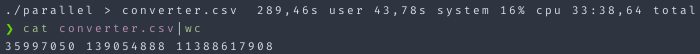

# Parallel

Performs a [sliced scroll](https://www.elastic.co/guide/en/elasticsearch/reference/current/paginate-search-results.html#slice-scroll). By using sliced scrolls the search is not limited to one request at a time but can be processed in parallel e.g. by Go routines in this case.

Requires `ELASTICSEARCH_URL` env variable set to the URL of your Elasticsearch. Authentication is not implemented.

## Note

You should adjust the following parameter to your needs ...

... in `query.json`

1. `field` please refer to the linked page for an explanation
2. `size` the maximum results **per** scroll

... in `main.go`

1. `index` the ES index to query
2. `maxID` how many go routines should be started respectively on how many parallel "workers" do you want to split up the search. Please refer to the linked page for more info about the relationship and impact to the number of shards.

## Performance

Not a comprehensive benchmark but to just give you an idea. The script fetched nearly 36 million documents and processed them into a CSV file in little more than 33 minutes. This was running on a 11th Gen Intel i7-1165G7 (8) @ 4.700GHz and 32 GB memory.
