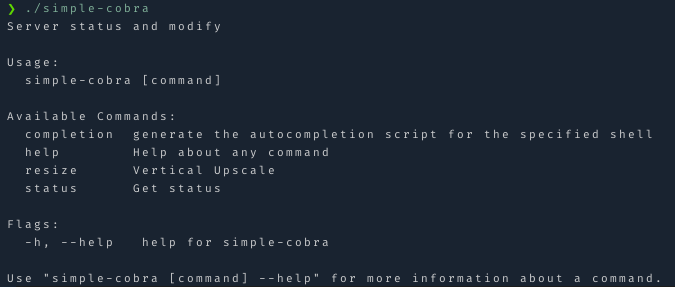

# Simple Cobra CLI

A simple one file CLI using [Cobra](https://github.com/spf13/cobra) (not following the recommended directory structure to keep it very simple)

To use auto completion:

```sh
go build
mv simple-cobra ~/.local/bin # (somewhere in your $PATH)
simple-cobra completion zsh > $HOME/.shell/zsh-completions/src/_simple-cobra
# reload / restart shell
```

Refer to the [cobra-docs](https://github.com/spf13/cobra/blob/main/shell_completions.md) for other shells and requirements.


